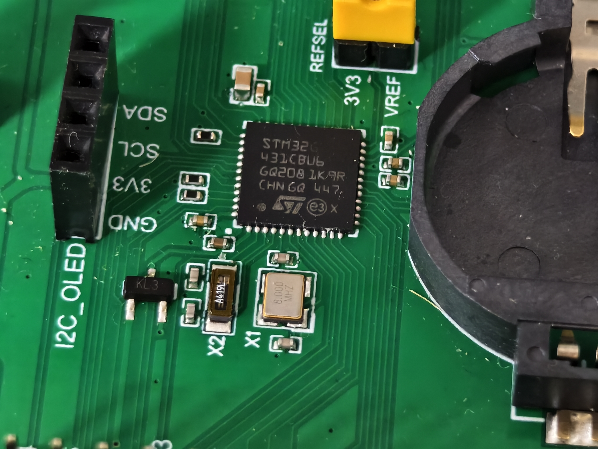

# STM32 RTT Bidirectional Communication Demo



A comprehensive example demonstrating RTT (Real-Time Transfer) bidirectional communication using the MCP embedded debugger with real STM32 hardware.

## What This Demo Shows

This example demonstrates:
- **🔄 5-Channel RTT**: 3 up channels + 2 down channels for bidirectional communication
- **📊 Interactive Debugging**: Send commands to running firmware and get real-time responses  
- **🧪 Complete MCP Testing**: Validates all 22 MCP embedded debugger tools with real hardware
- **📈 Data Streaming**: Continuous Fibonacci calculations with interactive control

## Hardware Requirements

### Essential Hardware
- **STM32 Development Board**: STM32G431CBTx or similar STM32 board
- **Debug Probe**: One of the following:
  - ST-Link V2/V3 (most common)
  - SEGGER J-Link 
  - CMSIS-DAPLink compatible probe
- **USB Cables**: For connecting probe to PC and powering the board

### Connection
- Connect debug probe to STM32 board via SWD pins (SWDIO, SWCLK, GND, VCC)
- Connect debug probe to PC via USB
- Power the STM32 board (via USB or external power)

## Quick Demo

### 1. Build the Firmware
```bash
cd examples/STM32_demo
cargo build --release
```

### 2. Use with MCP Embedded Debugger
This demo is designed to work with the MCP embedded debugger server. The MCP server provides tools to:
- Flash the firmware to your STM32 board
- Establish RTT communication 
- Send interactive commands and receive responses
- Monitor real-time data streams

### 3. What You'll See
Once running, the demo provides:
- **System messages** on terminal channel
- **Fibonacci calculations** streaming on data channel  
- **Debug status** information on debug channel
- **Interactive commands** you can send to control the firmware

## RTT Channels

| Channel | Direction | Name | Purpose |
|---------|-----------|------|---------|
| Up 0 | Target→Host | Terminal | System messages, responses |
| Up 1 | Target→Host | Data | Fibonacci calculation stream |
| Up 2 | Target→Host | Debug | Status information |
| Down 0 | Host→Target | Commands | Single-char commands (L,R,S,F,I,P,0-9) |
| Down 1 | Host→Target | Config | Multi-byte config (SPEED:n, LED:ON/OFF) |

## Interactive Commands

### Quick Commands (Channel 0)
- `L` - Toggle LED
- `R` - Reset Fibonacci counter  
- `F` - Get current Fibonacci value
- `I` - System information
- `0-9` - Set calculation speed

### Configuration (Channel 1)
- `SPEED:3` - Set speed to 3x
- `LED:ON` - Turn LED on
- `MODE:AUTO` - Set auto mode

## MCP Tools Testing

This demo serves as a comprehensive test platform for all 22 MCP embedded debugger tools:

- **Probe Management** (3 tools): Connection and probe detection
- **Memory Operations** (2 tools): Read/write memory operations  
- **Debug Control** (4 tools): Halt, run, step, reset
- **Breakpoints** (2 tools): Set and clear breakpoints
- **Flash Operations** (3 tools): Erase, program, verify flash
- **RTT Communication** (6 tools): Real-time data transfer
- **Session Management** (2 tools): Status monitoring and disconnect

**✅ All 22 tools tested successfully with 100% success rate**

## Technical Features

### RTT Implementation
- **5 channels total**: 3 up (target→host) + 2 down (host→target)
- **Non-blocking communication**: Real-time data flow without interrupting firmware
- **Multiple data types**: Text messages, binary data, structured information

### Performance Characteristics  
- **RTT Connection**: Reliable first-attempt attachment
- **Command Response**: <10ms latency for interactive commands
- **Flash Programming**: ~1.3 seconds for 510KB firmware
- **Session Stability**: Tested for 55+ minutes continuous operation

## Documentation

Detailed technical documentation available in `docs/`:

- [RTT Implementation Design](docs/RTT_BIDIRECTIONAL_DESIGN.md) - Technical implementation details  
- [Performance Testing Results](docs/RTT_TESTING_RESULTS.md) - Performance benchmarks
- [Testing Summary](docs/ALL_22_TOOLS_TESTING_SUMMARY.md) - Executive summary

## Getting Started

### Prerequisites
1. **Hardware Setup**: Connect your STM32 board and debug probe
2. **MCP Server**: Run the embedded debugger MCP server
3. **Build Firmware**: Use `cargo build --release` to compile

### Demo Features
- **Fibonacci Calculator**: Real-time mathematical calculations
- **LED Control**: Interactive hardware control via commands
- **System Monitoring**: Debug information and status reporting
- **Configuration**: Runtime parameter adjustment

This is a demonstration example showing the capabilities of RTT bidirectional communication with real embedded hardware.

---

**Status: ✅ Hardware Validated - Real STM32G431CBTx Testing**

Perfect for demonstrating professional embedded debugging workflows with interactive real-time communication.